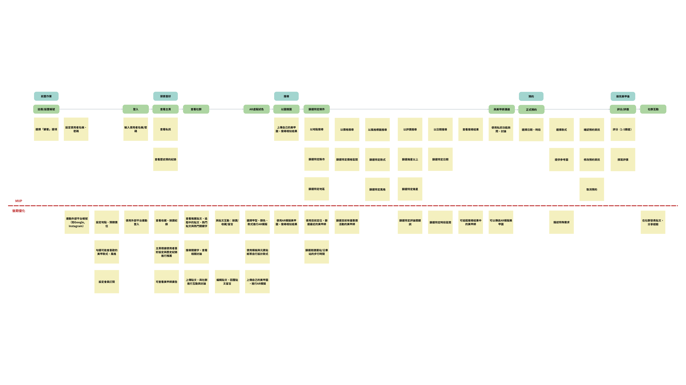
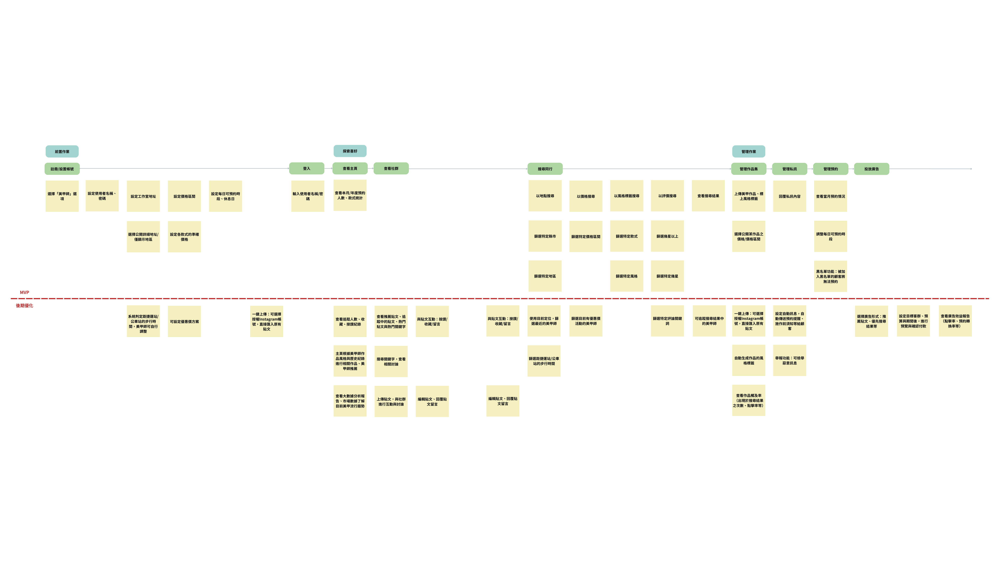
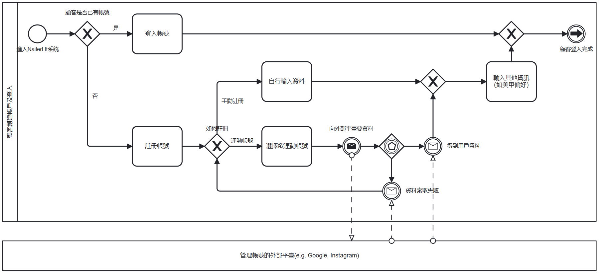
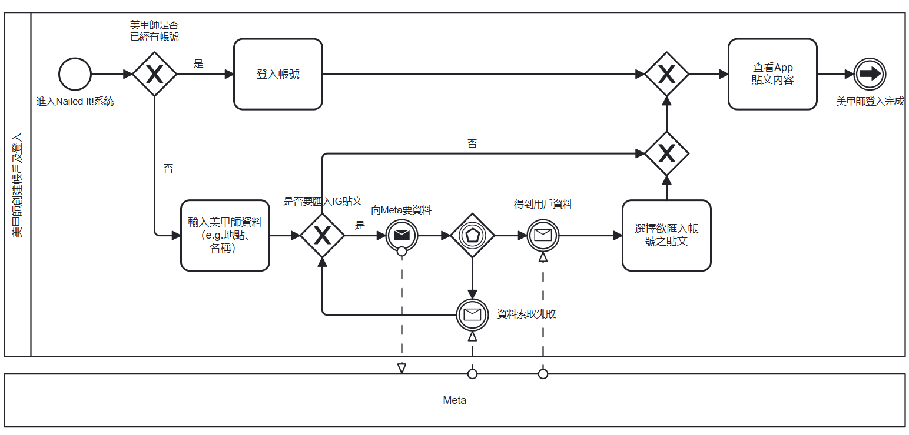
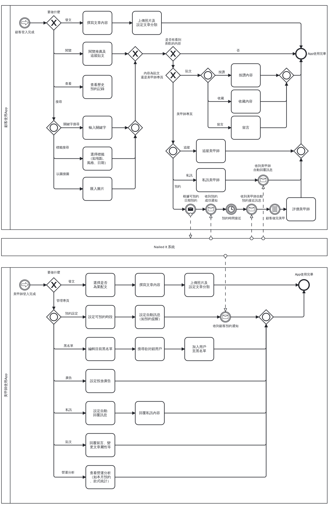

# Milestone 4 文件 README

[](https://github.com/yunn0123/nail-it/actions/workflows/railway-deploy-test.yml)
[](https://github.com/yunn0123/nail-it/actions/workflows/railway-deploy-test.yml)

[](https://nail-it-frontend.up.railway.app)
[](https://nail-it-backend.up.railway.app)  


---

## 專案說明
本專案旨在解決顧客與美甲師雙方在媒合上之痛點。現行美甲的商業模式缺乏統一平台整合作品、價格、評價與時段等資訊，導致顧客進行難以比較選擇，美甲師也需耗費心力應對重複詢問。

因此我們打造一站式美甲體驗的平台，以效率與透明為核心價值，整合多項功能以提升使用者與美甲師的互動與服務品質。顧客可以依據地點、價格、風格、評價等條件進行篩選，並新增以圖搜圖功能，提升搜尋效率。預約功能則讓美甲師設定可預約時段，顧客可直接查詢並預約服務。平台上亦包含評價功能，讓使用者能夠交流經驗與技巧。

https://github.com/yunn0123/nail-it 為有CI/CD程式碼的版本

---

## 研究方法
### User Stories Mapping
**顧客 User Story Map**

**美甲師 User Story Map**


此 User Stories Mapping 為專案設計初期所規劃，並於後續進行多次討論與調整，因此目前所呈現之 MVP 以實際專案內容及下方[「專案原始碼說明及操作方式」](#專案原始碼說明及操作方式)說明為主。

### Business Process Modeling Notation (BPMN)
**顧客註冊與登入**

以上包含的顧客功能有登入及註冊，而註冊方式又可分為手動註冊及連動外部帳號。目前MVP已開發手動註冊功能。

**美甲師註冊與登入**

以上包含的美甲師功能有登入及創建美甲師帳號。對於創建美甲師帳號部分，我們已在MVP實作出輸入資料功能，匯入IG貼文功能則為開發的下一階段。

**顧客美甲師使用系統**



### Low fidelity Wireframes 或 Figma 介面設計
請參考[figma](https://www.figma.com/design/Rjf409oAztkTuLwwuXXj2c/SAD-final-project?node-id=0-1&t=IZL3rwFdYMREtpGF-1)
### EER diagram

### Testing (詳細可看部署用[fork repo](https://github.com/yunn0123/nail-it/actions))
* CICD雲端部署
* mock單元測試（僅測試API是否有正確回應）   
---

## 專案原始碼說明及操作方式

### 前端與操作方式

#### 關於顧客，目前系統已開發出的功能如下：
詳細操作說明請參考：[frontend/README.md](frontend/README.md)

* 基本功能：註冊、登入、登出
* 主頁功能：推薦美甲師
* 搜尋功能：
  * 依名稱搜尋美甲師
  * 依條件搜尋美甲師作品
  * 以圖搜圖搜尋美甲師作品
* 預約功能：查看美甲師可預約時段並完成預約、查看歷史預約紀錄
* 評分功能：評分美甲師、查看歷史評分紀錄
* 聊聊功能：使用 LINE 連結與美甲師進行溝通
* 個人主頁：編輯個人資料、查看近期預約

未來針對顧客將會進一步開發：
* 社群交流功能（如按讚、追蹤、收藏等）
* 個人化推薦系統
* 內建的聊天室功能
* 隱私設定與個人偏好設定

#### 關於美甲師，目前系統已開發出的功能如下：
詳細操作說明請參考：[frontend/README.md](frontend/README.md)

* 基本功能：註冊、登入、登出
* 個人主頁：
   * 預覽顧客視角功能
   * 個人資料管理：編輯個人資料（如價位、地區等）
   * 預約管理：進行預約申請的確認與取消
   * 營業時段管理
   * 作品牆管理：編輯/刪除作品
   * 新增作品：含AI推薦標籤功能

未來針對美甲師將會進一步開發：
* 社群交流功能（如按讚、追蹤、收藏等）
* 評分顧客功能及黑名單功能
* AI流行趨勢報告、營運分析報告
* 內建的聊天室功能、自動回覆功能
* 投放廣告的功能
  
### 後端
對於後端，我們實作了以下功能：  
* 用戶註冊與登入(分美甲師註冊與顧客註冊)  
* 美甲師設定可預約時段  
* 查詢美甲師目前的空檔時段  
* 顧客預約美甲師時段  
* 搜尋功能：原本我們都是以 OPEN AI 的 API，但後來想挑戰「以圖搜圖」自己完成，因此做了嘗試，
  可惜時間太趕，因此雖然後端已經完成，但想再微調，所以先放在feature/image-search當中。
　  

詳細後端操作可至`/backend/nail-resv/README.md`閱覽  
連結：[Backend README](https://github.com/Enid1123/nail-it/blob/main/backend/nail-resv/API_DOCS_README.md)

---
### 資料庫
採用 Supabase 作為主要資料庫系統，負責儲存平台核心資料，如會員資訊、美甲師資料、預約紀錄與評價等。每張表之間的關聯可參考以上的EER diagram。因兩方使用者登入方式一致，所以使用 Supabase Auth 進行登入驗證，通過 RLS 政策，限制數據訪問、更改。添加觸發器實現3個功能：
*“insert_review_on_completed()”function當appointments表裡的預約狀態更新為“completed”時會同時在reviews(評價表)裡插入有關該預約的資訊且設評分與評論為空值。
*“restrict_review_update()function” 限制客戶在30天內更新評分和評論空值的部分,從service_date 開始算起。
*確保每次顧客對美甲師的預約進行評分後，若他們修改了評分就會觸發 trigger 執行 “update_artist_rating()” function自動更新該美甲師在 artists 表中的 rating 欄位（平均分，保留 1 位小數）。

---
### 資料蒐集

以 google map API 抓取店家資訊，分別蒐集他們店家基本資訊，如 : 店名、地址、電話和圖片等。

---  
### 部署     

railway service分別部署前後端，並透過railway後端公開網址連接前後端。

**服務網址**
- 前端應用：[nailed-it](https://nail-it-frontend.up.railway.app)
- 後端 API：[nailed-it-backend](https://nail-it-backend.up.railway.app)

**部署架構**
```
Frontend (Vue)      → Railway Frontend Service

     ↓ API 呼叫

Backend (Next.js)   → Railway Backend Service

     ↓ 資料庫連接

supabase
```

**環境配置**
- **生產環境變數**：已透過 Railway 環境變數設定
- **資料庫**：使用 supabase 服務
- **域名**：使用 Railway 自動生成的 `.railway.app` 域名
- **HTTPS**：Railway 自動提供 SSL 憑證

**部署監控**
- 服務健康狀態可透過 Railway Dashboard 監控
- 自動化部署：推送至 main 分支時自動重新部署
- 日誌查看：可在 Railway 控制台查看即時日誌
